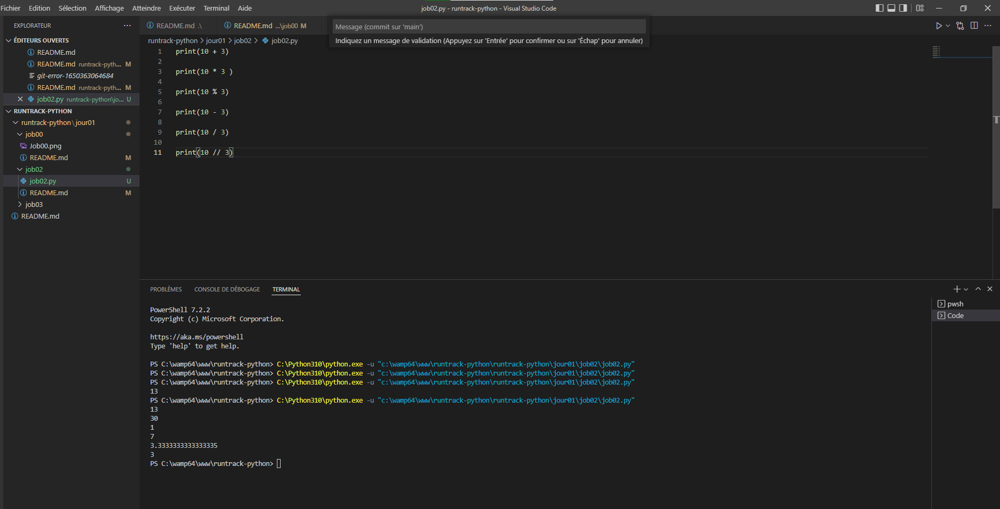

# Job 02

**Les opérateurs utilisables dans l‘interpréteur python sont :** +, -, *, /, // et %.

* Une fois dans l’interpréteur, essayez ces opérations.

10 + 3 
10 * 3 
10 % 3
10 – 3
10 / 3
10 // 3

