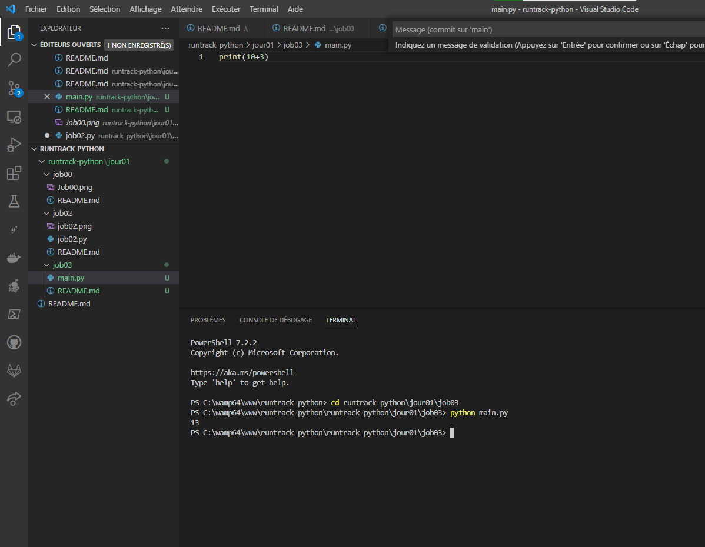

# Job 03

## Copiez le code ci-dessous dans un fichier nommé `main.py`` :

`print(10 + 3)`

## Assurez-vous que le résultat qui s’affiche dans le terminal soit 13 en exécutant votreprogramme grace a la commande :

`python3 main.py`

