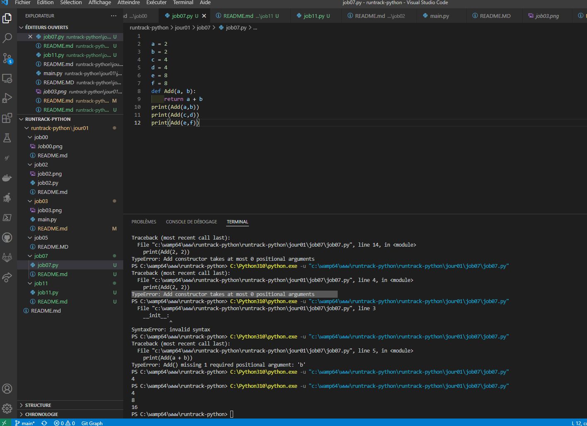

# Job 07

* Créez une fonction nommée Add. Cette fonction devra prendre 2 nombres entiers en paramètres et retourner la somme de ces 2 entiers.

* Depuis votre programme, appelez cette fonction plusieurs fois en y passant des paramètres différents et affichez ces résultats

