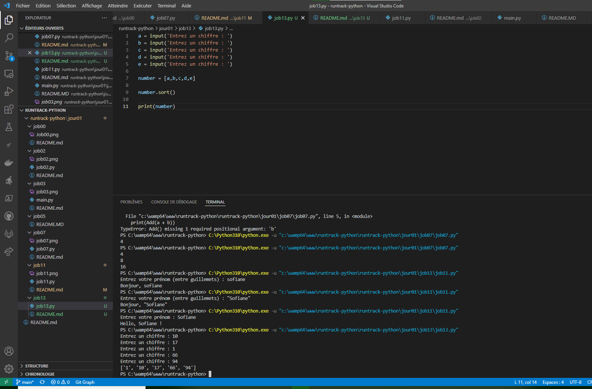

# Job 13

* Créez un programme qui demande 5 fois à l’utilisateur de renseigner un nombre entier.

* Stockez ces nombres entiers dans une liste puis triez-les par ordre croissant avant de les afficher, dans l’ordre, dans le terminal.

