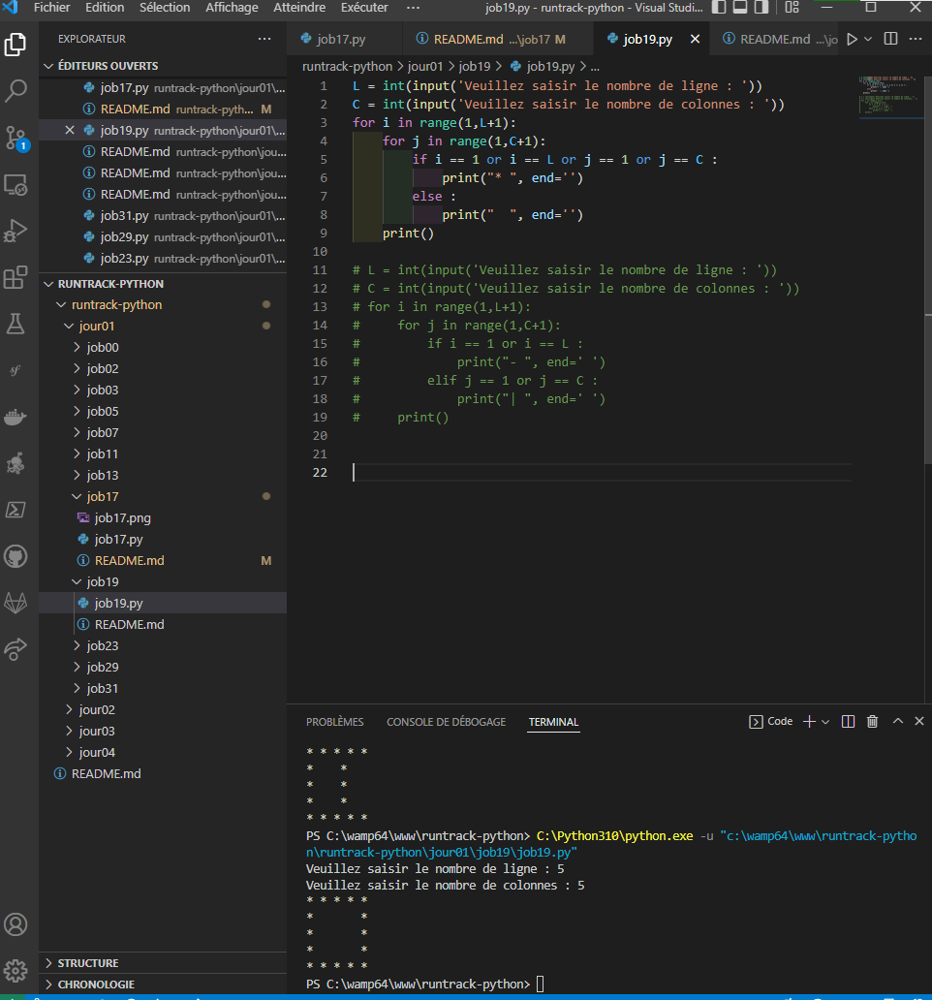

# Job 19

* Écrire un programme qui affiche dans le terminal un rectangle avec des ‘-’ et des ‘|’ en fonction des paramètres d’entrées, (width, height), par exemple :

* draw_rectangle(10, 3)

|--------|
|        |
|--------|

